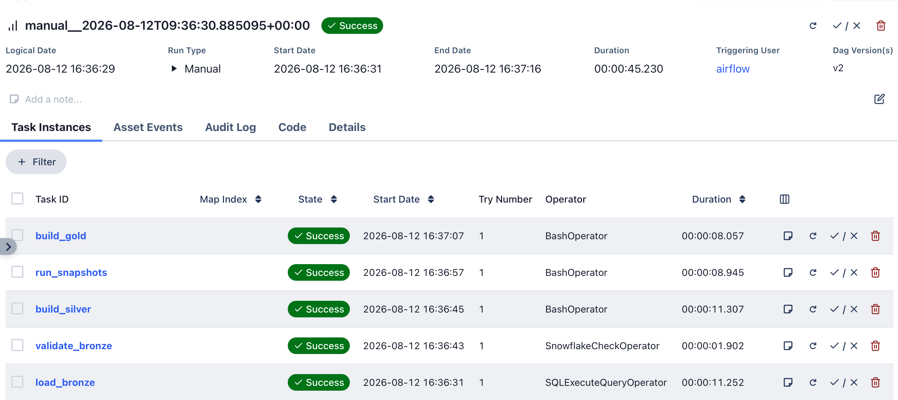
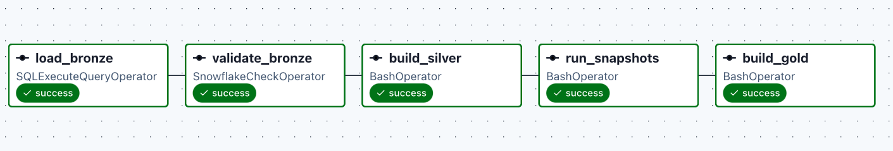
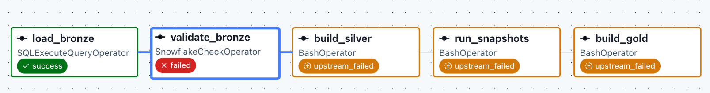

# Project Overview
## Repository Structure

```plain text 
.
├── airflow/
│   ├── dags/
│   ├── Dockerfile
│   ├── docker-compose.yaml
|   └── .env/example
├── bookstore_analytics/
│   ├── models/
│   └── snapshots/
├── snowflake/
│   ├── setup/
│   └── bronze/
└── README.md
```
## Bookstore Analytics Pipeline

An end-to-end ELT pipeline that loads bookstore CSV data from Amazon S3 into
Snowflake, transforms it with dbt, and orchestrates the workflow with Apache
Airflow.

The pipeline produces cleaned silver models, SCD Type 2 dimensions, and a
sales fact table for analytics.

## Airflow workflow 
load_bronze -> validate_bronze(check whether there is new data) -> build_silver -> run_snapshots -> build_gold

This Dag runs daily using @daily, while dbt manages dependencies between individual models. 

## Technology stack
- Apache Airflow 3.3 (For scheduling)
- dbt Core and dbt Snowflake 1.12 (For data transformation)
- Snowflake (Data Warehouse)
- Amazon S3 (Data Source)
- Docker Compose (For using Airflow)
- Python adn SQL (Programming Languages)

## Data Model 
Using Medallion Architecture including Bronze layer, Silver layer, Gold layer. 
- Data Source: csv files in AWS S3
- Bronze Layer: 13 raw source tables with filename, row number, batch ID, and load timestamp. Every column is set to VARCHAR(100) to make sure that it captures all of the data. 
- Silver: cleaned, cast, standardized, and deduplicated records.
Snapshots: SCD Type 2 history for books, customers, promotions,publishers, staff, and stores.
- Gold: six dimensions and fact_sales. 
  Also Include Gross sales, Net sales, Total cost, Gross profit

## Data-quality Check 
- Bronze tables must contain data before dbt starts. 
- Invalid foreigns keys are identified usign is_valid_* fields. 
- COPY INTO uses ON_ERROR = 'ABORT_STATEMENT'

## Local setup 
1. CLone this repo 
2. Configure the Snowflake insfrastructure using the scripts in snowflake/setup
3. Upload the source files to AWS S3 
4. Copy .env.example to airflow/.env
5. Create the private dbt profile. 
6. Build and initialize Airflow 
7. Start the sevices
8. Open the AIRFLOW UI and trigger the DAG
Commands
```bash
cd airflow

docker compose build
docker compose up airflow-init
docker compose up -d
```
Airflow URL 
```plain text
https://localhost:8080
```

## Results 

### Snowflake UI (Optional)

### Amazon S3 and IAM 

### Airflow 
Tasks 


A Dag when there is new data. 

If the folder is missing or any file loads zero rowss, pipeline stops. 
